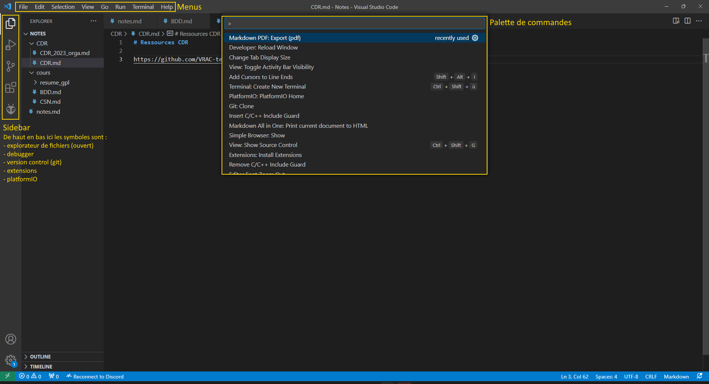

# Utilisation de VSCode

Beaucoup de tutoriels sont disponibles en ligne. Ici se trouve un guide simplifé de l'utilisation de VSCode.

Ce tutoriel est basé sur la vesion anglaise du logiciel. Because I can.

## Palette de commandes

A tout moment, vous pouvez ouvrir la palette de commandes de plusieurs manières :
- Engrenage en bas à gauche puis `Command Palette`
- `Ctrl+Shift+P`
- `F1`

Cette palette vous permet d'exécuter un grand nombre de commandes depuis une barre de recherche. Par exemple :
- `Transform to Uppercase` (transforme chaque lettre sélectionnée en majuscule)
- `Editor Font Zoom Out` et `Editor Font Zoom In` pour zoomer dans l'éditeur
- `Configure Display Language` pour changer la langue d'affichage
- et bien d'autres...

## Interface

Mis à part l'éditeur de texte, 2 menus sont visibles :
- la barre de menus en haut (File, Edit, Selection etc.)
- la Side Bar à gauche

Toutes les commandes executables depuis ce menu peuvent aussi être utilisées depuis la palette de commandes.

Vous avez donc :

## Barre de menus - options utiles

- `File - Auto Save` (active/désactive la sauvegarde automatique)
- `Terminal - New Terminal` (ouvre un terminal de commande)
- `File - Open Folder` (ouvre un dossier, tous les terminaux ouverts après avoir executé cette commande seront dans ce dossier)

On évite d'utiliser l'option `Open File` qui ouvre un seul fichier.

## Extensions

Pour chaque language de programmation et type de fichier, des extensions peuvent être installées pour ajouter des fonctionnalités à VSCode. 

Par exemple, il est possible de lire des PDF ou encore d'ouvrir et éditer des tableaux Excel depuis VSCode. C'est à vous de trouver les extensions si vous êtes intéressés.
