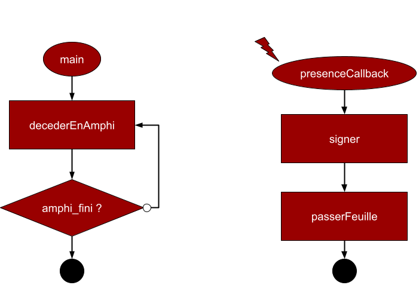

<!-- Pagination style -->
<style>
section::after {
  content: attr(data-marpit-pagination) '/' attr(data-marpit-pagination-total);
}
</style>

<!--Centered images -->
<style>
img[alt~="center"] {
  display: block;
  margin: 0 auto;
}
</style>


<!-- Title slide -->
<!--_footer: "Kézia MARCOU | AREM - 2024"-->
# Formation

## Interruptions et timers


---
# Remarques

- je peux faire des erreurs
- les slides et le code associé sont sur github
- si c'est pas clair posez des questions
- je pars du principe que vous savez écrire du C
- tout est testé sur des ST Nucleo L432KC (carte du PAMI)
- j'utilise platformIO mais Arduino IDE fonctionne aussi en théorie

---

## Sommaire

1. Généralités
2. Interruption sur un pin
3. Timers
4. Interruption Timer

--- 

<!--header: "Section : Généralités"-->
## Généralités

### C koi une yntérupscyom

Exemple : 
- vous travaillez la CdR en amphi
- la fiche de présence arrive

Vous faites quoi ? 

---



--- 

### Points clés

- l'interruption est causée par un **évènement extérieur** précis
- une fois l'interruption effectuée, on revient là où on en était avant


### A quoi ca ressemble sur un microcontrôleur ?

Une fonction spéciale qui est définie mais **jamais appelée**. 

Cette fonction est exécutée automatiquement après certains évènements.

--- 

### Interruptions et variables

Toute variable utilisée dans une interruption doit être **volatile**. 

Cela empêche le compilateur d'optimiser l'utilisation de cette variable (la fonction d'interruption n'est jamais appelée).

```c
volatile double vit_mesuree;
volatile uint32_t dist_mm;
```

Note : les interruptions se mèlent mal à certaines fonctions (printf...)

--- 

### Remarques

- les interruptions possibles dépendent du microcontrôleur

- la syntaxe des interruptions dépend de la marque/famille du microcontrôleur

- il faut souvent armer les interruptions au début du programme 

```c
HAL_TIM_IT_StartIT(...);
```

--- 

<!--header: "Section : interruption sur un pin"-->

### Interruption sur un pin

Sur Arduino : 
```c
attachInterrupt(digitalPinToInterrupt(pin), fonction, MODE);
```

Sur CubeIDE : 
- activer l'interruption depuis le .ioc
- ajouter la fonction Callback associée

--- 

### Programme 1 - au boulot 

Modifier le programme du système LED/Bouton de la dernière fois. 

La LED doit être allumée quand le bouton est appuyé. La fonction loop doit contenir comme 1ère ligne :

```c
delay(1000);
```

Bonus : ajouter une 2e LED, compter sur 2 bits le nombre de pressions sur le bouton.

--- 

<!--header: "Section : Timers"-->

## Timers 

Un timer est un compteur qui s'incrémente à pas de temps réguliers. 

Il a une valeur maximale, et recommence à 0 ensuite. 

---

### Timers sur STM32

Les timers d'une STM32 sont sur 16 ou 32 bits.

Ils ont chacun plusieurs fonctionnalités possibles :
- PWM output
- PWM capture (mesure de duty cycle)
- interruptions

--- 

### Utilisation de timers avec Arduino

Définition de variable globale
```cpp
TIM_TypeDef *Instance = TIM7;
HardwareTimer *MyTim = new HardwareTimer(Instance);
```

Dans le setup()
```cpp
MyTim->setOverflow(1, HERTZ_FORMAT);
MyTim->attachInterrupt(fonction); // retirer cette ligne si pas besoin d'interrupts
MyTim->resume();
```
--- 

### Documentation associée

#### https://github.com/stm32duino/Arduino_Core_STM32/wiki

Vous en aurez sûrement besoin.

N'oubliez jamais. When in doubt, RTFM.

L'alternative est : "Why should I spend 5 minutes reading documentation when I could spend 5 hours debugging instead".

**Your choice**

--- 

### Programme 2 - au boulot

Créer un programme qui allume une LED pendant 10s une fois qu'on appuie sur un bouton. 

Le programme doit fonctionner quelque soit le contenu de `loop()`.

Bonus : faire fonctionner un HC-SR04 en continu indépendamment du programme principal. glhf. Faites comme vous voulez même sans interruptions timer...

--- 

<!--header: ""-->

# Fin

La semaine prochaine : bases de la Programmation Orientée Objet.

